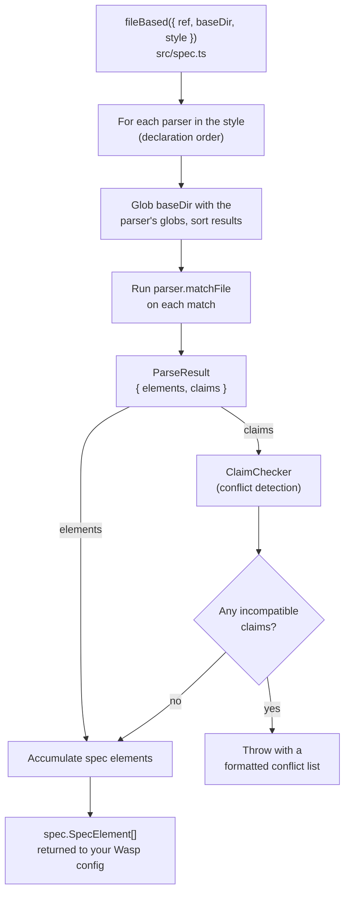

# Architecture

This package derives Wasp Spec elements from a project's file layout.

1. Scans a directory
2. Call a set of "parsers" that encode file conventions
3. Checks for conflicts (two parsers claiming the same file or two files claiming the same route)
4. Returns an array of Spec elements

This document explains the moving parts. For the user-facing conventions of the built-in style, see [docs/styles/default.md](docs/styles/default.md).

## The big picture



The core idea: a `Style` is a bag of `Parser`s. Each parser owns a glob, turns matching files into spec elements, and "claims" over the files and routes it consumes. A central `ClaimChecker` uses those claims to detect ambiguous layouts and fail loudly instead of producing a silently-wrong config.

## Source layout

The `src/` tree is split by _where the code conceptually lives_ rather than by feature:

| Directory | Role |
| --- | --- |
| `src/spec.ts` | The `fileBased` orchestrator. The `/spec` entry point. Touches the filesystem. |
| `src/index.ts` | The main entry point. Exports the `options()` helper and the `Options` types. |
| `src/in-files/` | Types for things that live in the _user's_ files (the shape of options files). |
| `src/in-spec/` | The engine: parser/style interfaces, the claims system, and spec-name generation. Style-agnostic. |
| `src/styles/default/` | The built-in convention set: one parser per route kind, plus options discovery. |

Three published entry points, each its own bundle (`tsdown.config.ts`):

| Import | Exports |
| --- | --- |
| `@wasp.sh/file-based-routing/spec` | `fileBased` (filesystem-touching; runs where the Wasp config is evaluated) |
| `@wasp.sh/file-based-routing` | `options`, the `Options` type, option type definitions |
| `@wasp.sh/file-based-routing/styles/default` | `defaultStyle`, the `Style` type |

## The orchestrator: `fileBased`

`fileBased` (`src/spec.ts`) ties everything together. Per call it:

1. Creates a context for Parsers to run in, with helpers like a `makeUniqueSpecName`, and a `ClaimChecker`.
2. Iterates the style's parsers. For each parser:
   - Registers the parser's static `claims` (e.g. "I own everything under `jobs/`").
   - Globs `baseDir` with the parser's `globs`.
   - Runs `parser.matchFile` on each match. A returned `ParseResult` contributes its `elements` to the output and its `claims` to the checker. A parser may return `undefined` to skip a file (e.g. an options file that is not itself a route).
3. After all parsers run, asks the `ClaimChecker` for conflicts. If any exist, it throws with a formatted, human-readable list. Otherwise it returns the accumulated spec elements.

Per-file parse errors are wrapped with the offending relative path for context.

`baseDir` defaults to `<cwd>/src/app`; `style` defaults to `defaultStyle`.

## The style / parser abstraction

Defined in `src/in-spec/parsers/common.ts`. This is the seam that makes conventions swappable.

```ts
interface Style {
  parsers: Partial<Record<RouteType, Parser>>;
}

interface Parser {
  // what files this parser matches
  globs: readonly string[];

  // static claims (independent of any match)
  // e.g. the Queries parser will claim the whole `queries/**` tree
  claims?: readonly Claim[];

  // the actual meat of the parser
  matchFile(file, ctx): Promise<ParseResult | undefined>;
}

interface ParseResult {
  // spec to emit
  elements: spec.SpecElement[];

  // claims for this specific match
  claims?: readonly Claim[];
}
```

## The claims & conflict system

Lives in `src/in-spec/claims/`. This is what keeps an ambiguous layout from producing a broken config.

A **claim** (`claims/index.ts`) is an assertion that a parser owns something:

- `FileClaim` — "this file is mine".
- `GlobClaim` — "every file matching this glob is mine"; normalized into individual file claims.
- `RouteClaim` — "this `method` + `route` is mine."

The `ClaimChecker` (`claims/checker.ts`) will store the File and Route claims individually. Adding a claim that collides with an existing one produces a `Conflict`.

This design lets parsers express intent declaratively rather than coordinating with each other:

- The page parser claims the file **and** a `GET` route on its path. The API parser claims a route per HTTP method (and `all.api.ts` claims all five methods). So a page and a `GET` api on the same path conflict, but a page and a `POST` api do not.
- An api namespace claims only its file, not a route, so it may share a path with a page or apis.
- The query/action/job parsers statically claim their whole directory tree (`queries/**`, etc.), so a stray file in those directories is attributed to the right parser.

Conflicts are formatted into messages like _Route "GET /tasks" can be generated from either a "page" spec or a "api" spec (from "...")_.

## Spec-name generation

We use a `specNameMaker` (`src/in-spec/spec-name.ts`), which takes a base name and a casing (`PascalCase` or `camelCase`) and returns a normalized, unique name. It lowers non-ASCII characters to ASCII (`deburr`: `café` → `cafe`, `españa` -> `espana`) and cases the name accordingly. It will add numbered suffixes if a similar name was already generated.

In the default style, each parser picks a casing and adds a kind suffix based on its type. Pages and routes are `PascalCase`; queries, actions, jobs, apis, and api namespaces are `camelCase` (matching Wasp's conventions):

- `src/app/dashboard/page.tsx` -> `DashboardPage` (page) and `DashboardRoute` (route)
- `src/app/tasks/get.api.ts` -> `tasksGetApi` (api)

## The default style

It's an adaptation of the Next.js App Router conventions, with a few additions for Wasp-specific concepts. See [docs/styles/default.md](docs/styles/default.md).

The only caveat is that options on a spec element are not defined as `export const options = { ... }` in the route file itself (as it would be in Next.js), but rather in a sibling `*.options.ts` file; so we avoid importing client-side code when parsing the files.

## Testing

Two layers, run with Vitest:

- **Unit tests** (`src/**/__tests__/`) cover individual helpers like route/name derivation.
- **Tree snapshot tests** (`tests/trees.test.ts`) are the main coverage. Each case under `tests/trees/<style>/<case>/` has an `input/` file tree, a `description.txt`, and an `output.json` snapshot. The test runs `fileBased` against the input and snapshots either the resulting spec elements or the serialized error.

## Extending with a new style

Because `fileBased` is style-agnostic, adding a convention set means: implement a `Parser` per kind you support (each emitting appropriate elements and claims), assemble them into a `Style`, and pass it as `style`. The claims system, spec-name generator, conflict reporting, and orchestration all work unchanged. Add a `trees/<your-style>/` directory and register the style in `tests/trees.test.ts` to get the same snapshot coverage.
